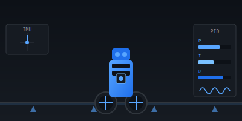
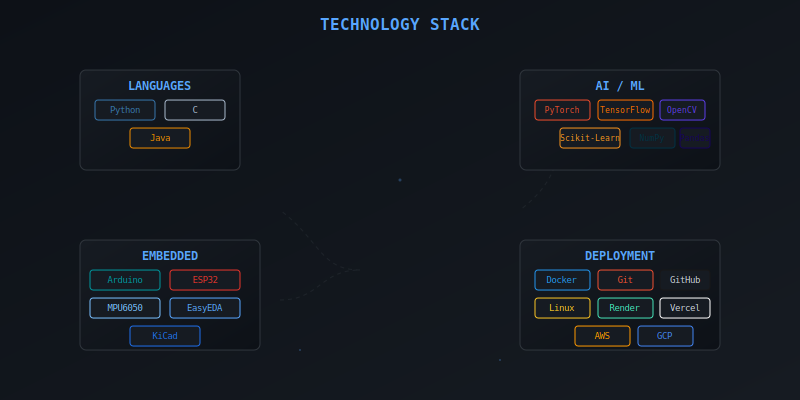
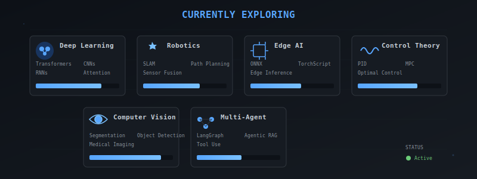
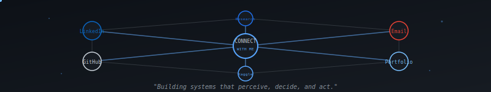

<!-- Engineering Intelligence Portfolio -->
<!-- Built with custom SVG animations for GitHub compatibility -->

<!-- Animated Hero Section -->

---

### Engineering Intelligence

**From Circuits → Control → Neural Networks**

---

## ◈ About

<table>
<tr>
<td valign="top" width="50%">

**Sagnick Paul**  
Electrical Engineering Undergrad @ **Jadavpur University**

Kolkata, West Bengal, India

Building intelligent systems at the intersection of **control theory**, **machine learning**, and **embedded hardware** — from sensor fusion on microcontrollers to CNN pipelines in PyTorch.

</td>
<td valign="top" width="50%">

**Focus Areas**

- Artificial Intelligence & Machine Learning
- Robotics & Autonomous Systems
- Computer Vision
- Intelligent Control Systems
- Embedded Systems

**Open To**

AI/ML · Robotics · Intelligent Systems Internships

</td>
</tr>
</table>

---

## ◈ Featured Projects

### TraffIQ — Autonomous Traffic Intelligence

> Real-time traffic monitoring with autonomous signal control

**Core Technologies**

`YOLO` `ONNX` `OpenCV` `Computer Vision` `Deep Learning`

**Highlights**

- Object detection and tracking using YOLO
- Optimized inference with ONNX runtime
- Real-time traffic flow analysis
- Adaptive signal timing based on vehicle density

---

### Multi-AI Agent System — Distributed Intelligence

> Collaborative AI agents with shared knowledge base

**Core Technologies**

`LangGraph` `FastAPI` `PostgreSQL` `Gemini` `Mistral` `RAG` `Multi-Agent Systems`

**Highlights**

- Autonomous agent orchestration with LangGraph
- Vector-based knowledge retrieval
- Multi-model integration (Gemini + Mistral)
- RESTful API with FastAPI

---

### NeuroSeg AI — Medical Imaging

> Deep learning for clinical MRI analysis

**Core Technologies**

`PyTorch` `UNet` `Computer Vision` `Medical Imaging` `Segmentation` `Dice` `IoU`

**Highlights**

- End-to-end segmentation pipeline
- Domain-specific preprocessing
- Clinical evaluation with Dice & IoU
- Modular backbone architecture

---

### Self-Balancing Robot — Control Systems

> Real-time PID stabilization on constrained hardware

**Core Technologies**

`Arduino` `ESP32` `PID` `MPU6050` `Sensor Fusion` `Embedded Systems`

**Highlights**

- Real-time PID control loop
- 6-axis IMU sensor fusion
- Bluetooth parameter tuning
- Stable operation on inclines

---

## ◈ Technical Skills

---

## ◈ GitHub Statistics

---

## ◈ Currently Exploring

---

## ◈ Let's Connect

I'm actively looking for **internship opportunities** in AI/ML, Robotics, and Intelligent Systems.  
If you're building something interesting — let's talk.

---

**Sagnick Paul** — Building the future of intelligent systems.

*"The best control system is one that makes complexity invisible."*

---

<!--
  This README uses custom SVG animations for GitHub compatibility.
  All animations are built with SMIL and require no JavaScript.
  Optimized for GitHub Dark Theme rendering.
-->